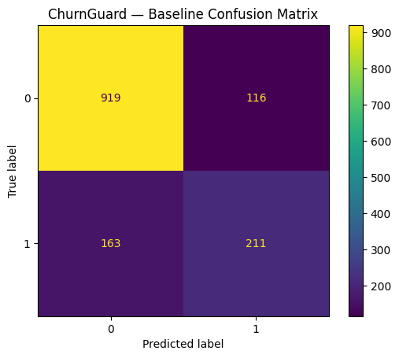
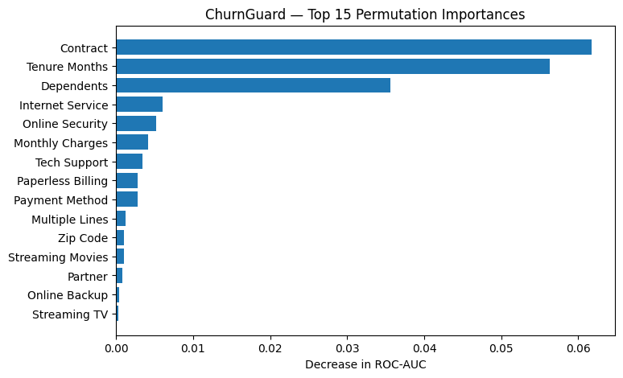

# ChurnGuard — Explainable Customer Churn Prediction

Predict customer churn using machine learning and explain *why* customers are likely to leave.

## Project Status
🚧 In progress — building an end-to-end ML pipeline

## Goals
- Build a clean, reproducible machine learning pipeline
- Train and evaluate baseline and improved models
- Add explainability to support decision-making
- Demonstrate good software engineering practices

## Planned Tech Stack
- Python
- Pandas, NumPy, scikit-learn
- Matplotlib / Seaborn
- Git

## Roadmap
- [ ] Data ingestion & cleaning  
- [ ] Baseline model (logistic regression)  
- [ ] Model evaluation (ROC-AUC, F1)  
- [ ] Feature importance & explainability  
- [ ] Inference script  

## Results

| Model | ROC-AUC | F1 |
|---|---:|---:|
| Logistic Regression (baseline) | 0.835 | 0.573 |
| Random Forest | 0.834 | 0.586 |
| Gradient Boosting | **0.854** | 0.584 |

### Baseline Confusion Matrix

### Feature Importance (Permutation Importance)

**Notes**
- Leakage columns (e.g. *Churn Reason*, *Churn Score*) were removed to ensure fair evaluation.
- ROC-AUC and F1 were chosen due to class imbalance.
- Gradient Boosting achieved the strongest overall discrimination.
